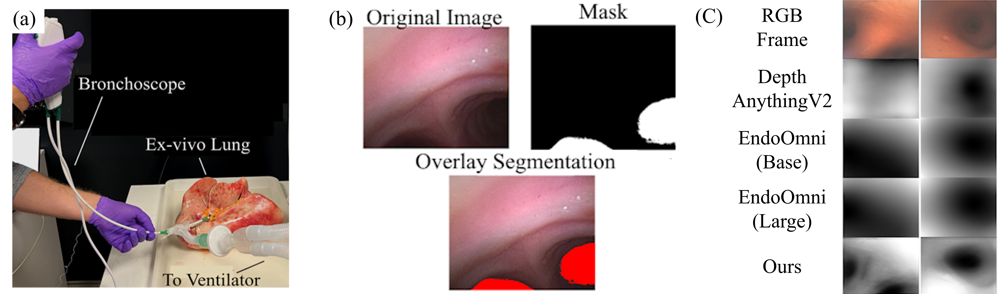

The GitHub page for our work, BREA-Depth: Bronchoscopy Realistic Airway-geometric Depth Estimation, is now available. Currently, only the inference code and a sample of our proposed dataset have been released. The full code and dataset will be made available upon acceptance.

## Overview

Monocular depth estimation in bronchoscopy can significantly improve real-time navigation accuracy and enhance the safety of interventions in complex, branching airways. Recent advances in depth foundation models have shown promise for endoscopic scenarios, yet these models often lack anatomical awareness in bronchoscopy, overfitting to local textures rather than capturing the global airway structure—particularly under ambiguous depth cues and poor lighting.
To address this, we propose Brea-Depth, a novel framework that integrates airway-specific geometric priors into foundation model adaptation for bronchoscopic depth estimation. Our method introduces a depth-aware CycleGAN, refining the translation between real bronchoscopic images and airway geometries from anatomical data, effectively bridging the domain gap. In addition, we introduce an airway structure awareness loss to enforce depth consistency within the airway lumen while preserving smooth transitions and structural integrity. By incorporating anatomical priors, Brea-Depth enhances model generalization and yields more robust, accurate 3D airway reconstructions. To assess anatomical realism, we introduce Airway Depth Structure Evaluation, a new metric for structural consistency.
We validate BREA-Depth on a collected ex-vivo human lung dataset and an open bronchoscopic dataset, where it outperforms existing methods in anatomical depth preservation.


## Dataset


(a) The experimental setup for data collection with an ex-vivo human lung. A commercial bronchoscope (Ambu aScope 4, Ambu Ltd.) is used by an expert bronchoscopist to navigate the lung.
(b) Airway lumen segmentation from our dataset, providing essential ground truth for Airway Depth Structure Evaluation.
(c) Qualitative comparison of our model’s depth estimation results (disparity). The predicted depth map clearly highlights the airway lumen and captures fine anatomical details around airway branches.

## Inference
```
python Infer.py --input_folder Input --output_folder Output 
```
Our trained weights can be downloaded from these links: [Google Drive](https://drive.google.com/drive/folders/1mFOKW2OIbGlm_1edv_oenKm2jjKfBT4o?usp=drive_link) or [OneDrive](https://uoe-my.sharepoint.com/:f:/g/personal/xzhang19_ed_ac_uk/ElxJu_eRjeFIhQCUXygyc50BMhc1fB0INsz457FCE0ZT8A?e=6Vc4Ek)

You can also generate a side-by-side RGB and depth estimation video for visual inspection:

```bash
python Infer_Video.py --input_folder Sample
```

**Important Notes:**

- Input frames must be RGB images (`.jpg`, `.png`, or `.jpeg`) with 3 channels.

- The inference script must set `real=False` in the forward pass:

  ```python
  self.model(image_with_depth, real=False)
  ```


## Citing

If you find this work useful, please consider our paper to cite:

```
@inproceedings{brea_depth2025,
  author    = {Francis Xiatian Zhang and Emile Mackute and Mohammadreza Kasaei and Kevin Dhaliwal and Robert Thomson and Mohsen Khadem},
  title     = {{BREA-Depth: Bronchoscopy Realistic Airway-geometric Depth Estimation}},
  booktitle = {Medical Image Computing and Computer-Assisted Intervention -- MICCAI 2025},
  year      = {2025},
}
```
